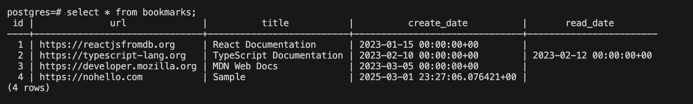
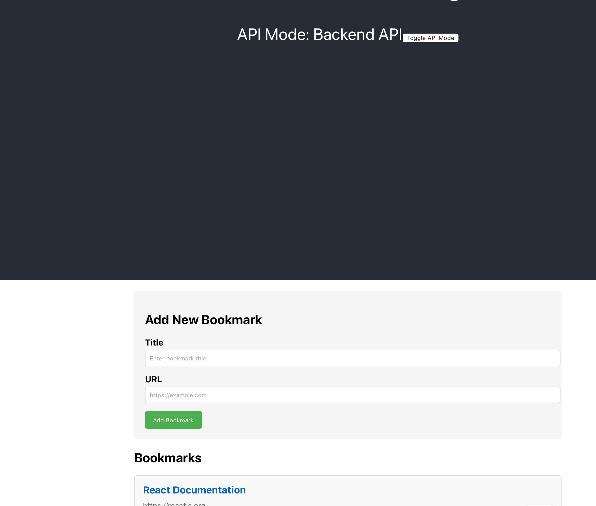

## The goal of this project is to code with LLM. 
 - the devcontainer setup was manual.
 - the readme updates are manual.

### Progress:



## Prompts used
1. Rewrite this app in typescript
2. update the frontend application to implement a bookmark manager for web urls. I want the ability to list bookmarks and mark them as read. For the frontend app, create a new mock api to return the bookmarks. The bookmark has a url, a title, create_date, read_date.
    1. {One compiler error. copy pasted and resolved.}
3. now implement the api logic in the backend app and wire it up with the frontend app. For now, the backend app should use a mock api layer. the frontend app should have an option to use its mock api or to use the backend api.
    1. can you instead use the proxy setting on the frontend app to solve the cors issue?
4. Now, let's hook up the backend api to the postgres instance. The development config should allow switching between the mock bookmark repository and the real postgres instance.
    1. get the postgres user, password, database from environment variables
5. Create dockerfile to deploy the frontend and the backend app into a single container. Include all the environment variables used in the code base.
    1. {npm error. copy pasted, resolved.}
    2. {404 error on api call, copy pasted the response headers, nginx configuration updated.}
    3. move the docker related files to /deploy
    4. {copy pasted error due to incorrect paths after move}
    5. {manually removed the backend api port expose. removed the version on docker compose.}

## Setup instructions
1. Setup the postgres config in .devcontainer/.postgres.env (copy the sample, rename it to .postgres.env and fill in the values)
2. Load the devcontainer

### create the react app in the container
```zsh
npx create-react-app <appname>
```

### create dotnet webapi
```zsh
dotnet new webapi -o <project_name> --use-controllers --use-program-main
```

### create dotnet gitignore
```zsh
dotnet new gitignore
```

### create new controller
```zsh
dotnet new apicontroller --actions --name <controller name>
```

## Deploy the app
```zsh
cd deploy
docker compose up --build
```